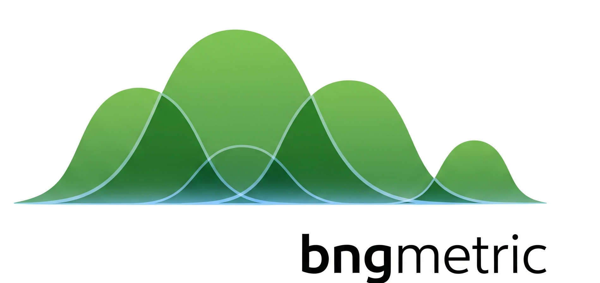

An open source Python implementation of the UKs Biodiversity Net Gain Metric

## Overview

This project is currently in development. It provides an open source Python implementation of the UK's Biodiversity Net Gain (BNG) Metric, a standardized approach to measuring biodiversity impact.

## Implementation

bngmetric is written in JAX to enable more sophisticated analyses in the future, such as gradient-based optimization and uncertainty quantification. However, it's designed to work as a straightforward Python drop-in replacement for existing BNG calculation methods.

## Status

- 🚧 **In Development**: This project is actively being developed
- 📦 **Python Package**: Will be published as a Python package
- 📄 **Open Source**: Free to use and contribute to

## Getting Started

Documentation and installation instructions coming soon.

## License

This project is open source and will be available via PyPI.
